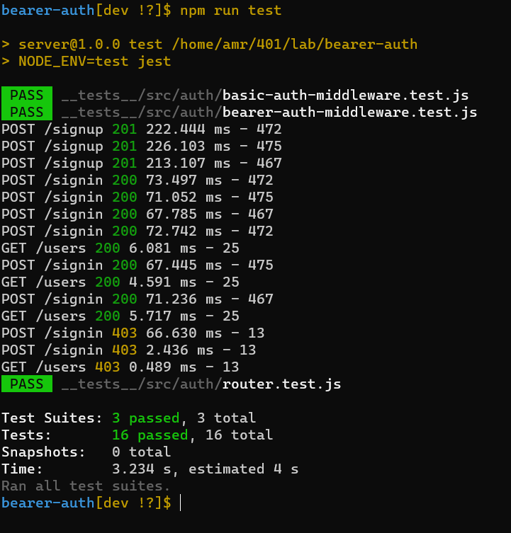
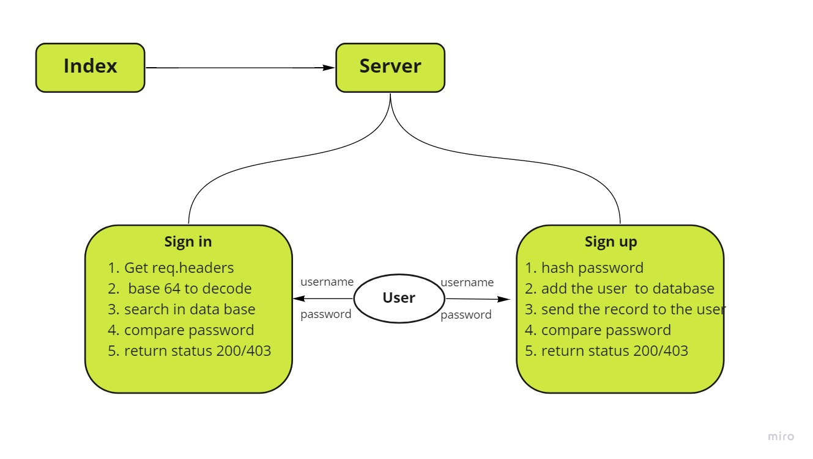

# bearer-auth

## Author: Amr Nzzal

### Links and Resources

- [Pull Request](https://github.com/amr88nzzal/bearer-auth/pulls)

- [GitHub Actions](https://github.com/amr88nzzal/bearer-auth/actions)

- [Heroku - app](https://bearer-auth-amr.herokuapp.com/)

### Setup

- Clone the repo to your device
- run `npm install` to install node modules
- Run `nodemon` or `npm run dev` to see your live server via local host in your browser.

### Use

- You can create a new user by  `/signup` route, then sign into the route with the `/signin` route.

```JS
{ "username": "TEST", "password": "TEST" }
```

### Test

In the command line at the root directory, `run npm test` to make sure all test are passing as expected.


### UML / WRRC



